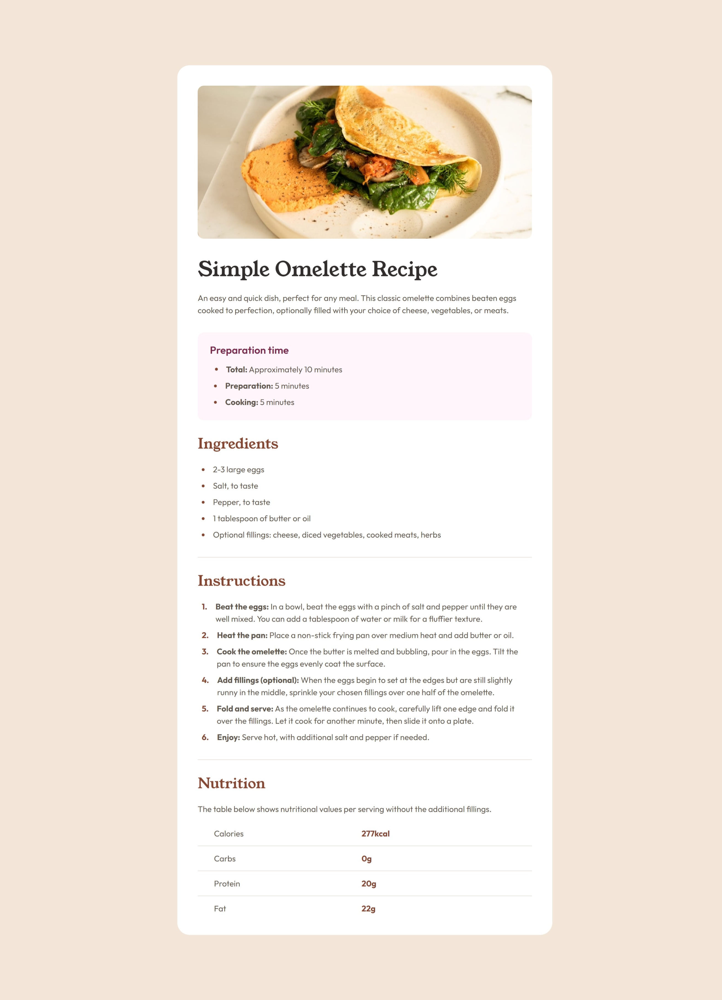
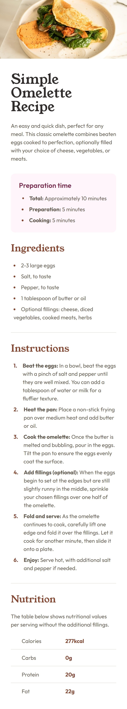

# Recipe page solution

## Table of contents

- [Overview](#overview)
  - [The challenge](#the-challenge)
  - [Screenshots](#screenshots)
  - [Links](#links)
- [My process](#my-process)
  - [Built with](#built-with)
  - [What I learned](#what-i-learned)
  - [Useful resources](#useful-resources)
- [Author](#author)

## Overview

### Screenshots




### Links

- Solution URL: [Code](https://your-solution-url.com)
- Live Site URL: [RECIPE-PAGE](https://your-live-site-url.com)

## My process

### Built with

- Semantic HTML5 markup
- CSS custom properties
- Flexbox
- CSS Grid

### What I learned

I refreshed my knowledge in styling list and table. The below styles are the one which I re-learned and found difficulty in adjusting the styles.

```css
ol{
  counter-reset: section;
  list-style-type: none;
}
ol li::before {
    counter-increment: section;
    content: counters(section,".") ".";
}
.total-list-elem::before{
    content: "•";
    font-size: 29px;
    line-height: 0px;
    vertical-align: middle;
    color: var(--brown-800);
}

```

### Useful resources

- [Resource 1](https://www.w3schools.com/cssref/pr_list-style-position.php) - This helped me for understanding list styling and various options. 

## Author

- Website - [Rinta Roy](https://www.linkedin.com/in/rinta-roy)
- Frontend Mentor - [@rinta-git](https://www.frontendmentor.io/profile/rinta-git)
